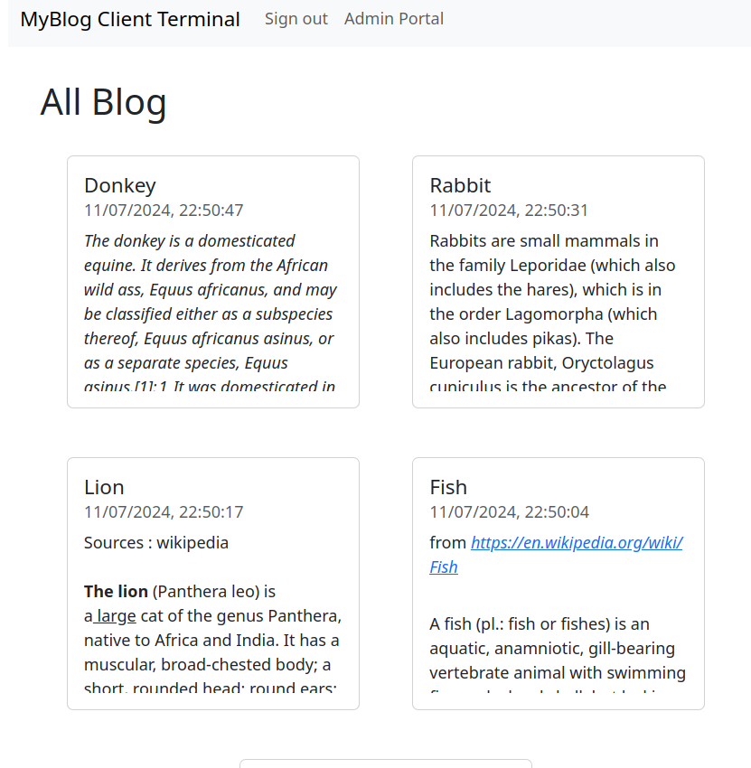

# Blog / odin-blog-api

A simple react-based blog web app built with vite, to fetch data from backend API. This is part of projects built along The Odin Project Course.

## Live demo

- FrontEnd - Client       : https://odin-blog-api-client.netlify.app/
- FrontEnd - Admin        : https://odin-blog-api-client-admin.netlify.app/
- Backend  : https://odin-blog-api-ycwong66.adaptable.app/

## Tech stack 
- FE: React / Bootstrap 
- BE: Express / MongoDB / JWT Auth

## Source
- FrontEnd - Client : https://github.com/WongYC-66/odin-blog-api-client
- FrontEnd - Admin : https://github.com/WongYC-66/odin-blog-api-clientAdmin
- Backend : https://github.com/WongYC-66/odin-blog-api

## Installation
1. Create .env file and fill in like .env-sample, place ur mongoDB connection string at DATABASE_URL

## API
### Authentication API with JWT :
- POST http://[url]/v1/user/sign-in/
- POST http://[url]/v1/user/sign-up/

### Rest API :
1. POST-CRUD
- GET http://[url]/v1/posts
- POST http://[url]/v1/posts
- GET http://[url]/v1/posts/[post_id]      
- PUT http://[url]/v1/posts/[post_id]
- DELETE http://[url]/v1/posts/[post_id]

2. COMMENT-CRUD
- GET http://[url]/v1/comments/[post_id]
- POST http://[url]/v1/comments/[post_id]
- PUT http://[url]/v1/comments/[comment_id]
- DELETE http://[url]/v1/comments/[comment_id]